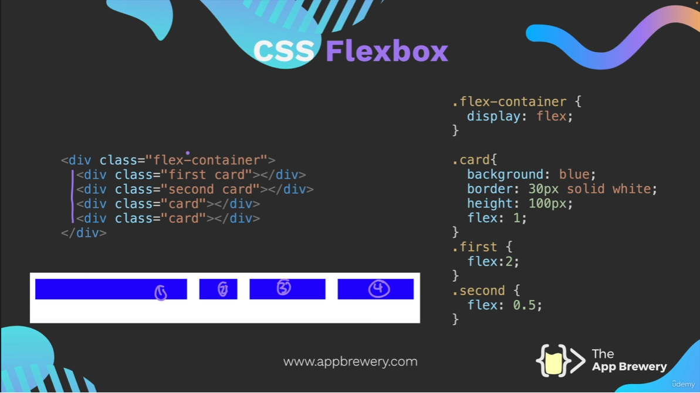
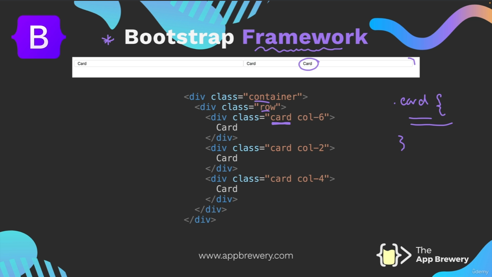

# Section 8 Notes - Advanced CSS

## Creating Responsive Websites:

### Media Queries: 

Specify different CSS for different browser sizes. Media queries are like if statements for CSS.

E.g. 

```css
div {
    background-color: red;
    height: 200px;
    width: 200px;
}

/*When the browser is less than 600px wide and greater than 300px wide, change the div height and width to 100px:*/  
@media (max-width: 600px) and (min-width: 300px){
    div {
        height: 100px;
        width: 100px;
    }
}
```

### CSS Grid:

CSS Grid is a 2D layout system that allows you to create responsive layouts for your website. Grid is ideal for two-dimensional layouts where control over both rows and columns is needed.

### CSS Flexbox

CSS Flexbox is a 1D layout system that allows you to create responsive layouts for your website. 



### External Frameworks:

External frameworks like Bootstrap and MaterialUI can be used to quickly create responsive websites.

E.g. Bootstrap has defined a bunch of CSS Classes that provide different rules for different selectors with pre-styling.

